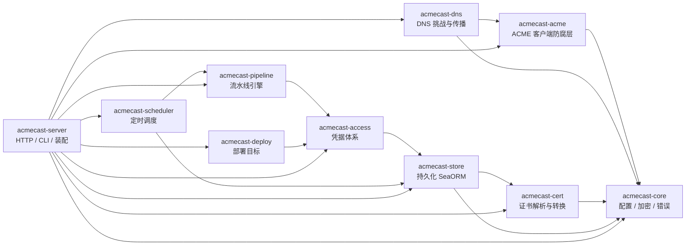

# 架构设计

acmecast 是一个 Cargo workspace：10 个内部 crate（均不发布到 crates.io）加一个
React 前端 SPA。可执行二进制只有一个：`acmecast-server`。

## Crate 划分与依赖方向

依赖单向、职责正交：

| Crate | 职责 | 关键约定 |
|---|---|---|
| `acmecast-core` | 配置装载（YAML + env 覆盖）、AES-256-GCM 凭据加密、统一错误类型 | 不依赖任何其他 acmecast crate，是所有上层的基座 |
| `acmecast-cert` | 证书解析、到期状态判定、PEM/DER/PFX/P7B/JKS 转换、私钥校验 | 只处理内存字节，不落盘（落盘归 store）、不签发（归 acme）；纯 Rust 无 OpenSSL |
| `acmecast-acme` | ACME 账号/订单/挑战/吊销，基于 `instant_acme` | 防腐层：底层类型不出现在公开签名；`testing` feature 提供进程内 mock CA |
| `acmecast-dns` | DNS provider（cloudflare/aliyun）、TXT 记录生命周期、传播等待、权威 NS 直查 | 写入→执行→无论成败都清理；传播判定以权威 NS 一致为准 |
| `acmecast-store` | SeaORM 三方言（SQLite/MySQL/PostgreSQL）连接、版本化迁移、10 张表实体、仓储层、文件存储（FileStore） | 迁移只增不改；时间一律 UTC |
| `acmecast-access` | 凭据类型注册表、凭据仓库（解密/校验/引用检查）、内建 `acme.account` 凭据类型 | 凭据字段整体替换；仍被引用的凭据拒绝删除 |
| `acmecast-pipeline` | `PipelineStep` 契约、执行器、产物、事件、历史、流水线级 KV 状态、并发闸门 | 无状态单例步骤 + 显式注册；单步失败即中止后续步骤 |
| `acmecast-deploy` | `DeploymentTarget` 契约、`local`/`ssh` 目标、幂等部署记录、SSH 主机档案 | 同指纹跳过写入但重载照跑；先写临时文件再原子替换 |
| `acmecast-scheduler` | cron 触发、到期扫描、去重窗口、触发审计 | 每 30 秒 tick 一次；重启时装载并可选补跑 |
| `acmecast-server` | clap CLI、axum HTTP、JWT 鉴权、OpenAPI、SPA 托管、内置步骤装配、调度器启动 | 唯一的可执行 crate |

## 内置步骤 / 提供商 / 目标 / 凭据类型

server 启动时显式注册（重复注册即报错，不用链接器魔法）：

- **步骤**：`cert.apply`（ACME 申请）、`cert.store`（证书入库）、`cert.deploy`（部署）
- **DNS 提供商**：`cloudflare`、`aliyun`
- **部署目标**：`local`（本地文件系统）、`ssh`（SSH 远程主机）
- **凭据类型**：`acme.account`、`cloudflare`、`aliyun`、`ssh`（SSH 主机档案）

## 关键横切机制

### 凭据安全

凭据字段以 AES-256-GCM 加密后落库（`nonce(12B) || ciphertext || tag`，base64
存储）；加密密钥 `ACMECAST_CREDENTIAL_KEY` 只存在于环境变量。步骤执行时按
`credential_id` 现取现解密，不驻留配置、不跨运行缓存。日志不得写入凭据明文，
报错回显前经 `redact` 脱敏。

### 幂等

- 部署：目标键（`sha256` 输入摘要）+ 证书指纹一致且未 `force` → 跳过写入，
  重载命令仍执行；部署记录只在**成功后**写入。
- 入库：同一域名集合再次入库是 `Updated` 而非新增记录。
- 续期触发：运行中检查 + 去重窗口（默认 1 小时）双保险。

### 一致性

- 到期状态判定有**唯一实现**（`acmecast-cert` 的 `ExpiryPolicy`），store 实体
  委托同一函数，避免两处逻辑漂移。
- 历史记录先插 `running` 行、跑完原地改写终态，崩溃遗留的 running 视为仍在
  运行（宁可不自动触发）。
- 所有注册表的错误都列出已注册清单，配置错误能直接看到可选项。

## 前端

`frontend/`：React 19 + TypeScript + Vite 7 + Ant Design 6 + react-router 7 +
zustand + @tanstack/react-query + openapi-fetch。API 类型由
`openapi-typescript` 从 `/api/openapi.json` 生成。生产构建产物由后端同源托管
（SPA fallback 以 200 交出 `index.html`），无 CORS 层。
